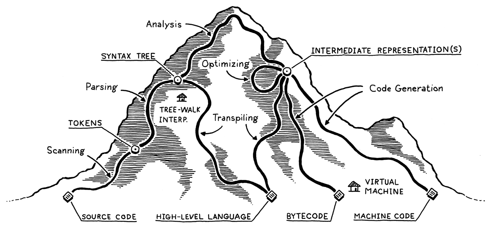
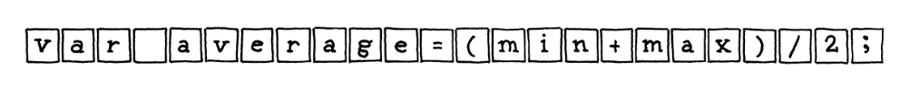
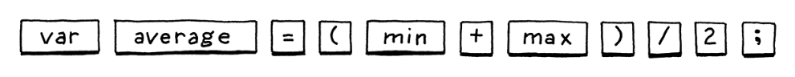
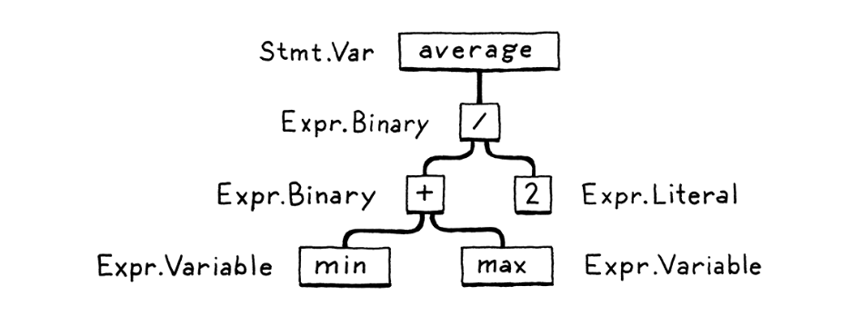

# Ch. 2 - A Map of the Territory

* Let's take a look at our roadmap

### 2.1 - The Parts of a Language

* Programming languages are designed roughly the same today as they were when they were first invented
* Let's visualize the overall path an interpreter takes to go from source code to machine code:

* We visualize the path as a mountain, where we start at the base on the bottom-right with the source code
* We parse and analyze the source code, until we arrive at the "peak", where we have a bird's-eye view of the user's program and know what the code *means*
* We then descend the other side of the mountain, and transform this high-level view into sucessive forms of lower-level code, slowly getting closer to something the CPU can actually execute
* Let's start with some actual source code:

* As you can see, the source code consists of a number of ASCII characters in sequential order
  
##### Scanning

* The first step is **scanning**, also called **lexing** or **lexical analysis**
* A **scanner** or **lexer** is code that takes in a linear stream of characters and chunks them together into a series of **tokens**, which are the "words" of the programming language
* Some characters are ignored by the scanner, depending on the language (e.g. most languages ignore whitespace, some even ignore new lines)

##### Parsing

* The next step is **parsing**, where our syntax gets a **grammar**
* This means that the flat sequence of tokens is converted into a tree structure that represents the logic and grammar of the language
* These are called **parse trees**, **syntax trees**, **ASTs**, or just **trees**
* An error at this step would be called a **syntax error**

##### Static Analysis

* The previous two steps are fairly similar across most languages
* Now, the individual characteristics of a language come into play
* Some of the analysis interpreters do:
  * **Binding** or **resolution**: For each identifier, find where that name is defined, and wire the two together
  * **Scope**: Find the accessability of each identifier
  * **Type**: If the language is statically typed, that's checked here. An error here would be a **type error**
* Often this information is stored as **attributes** on the syntax tree itself, or in a lookup table on the side (called a **symbol table**)
* The most powerful bookkeeping tool is to transform the tree into an entirely new data structure that more directly expresses the semantics of the code. That’s the next section!
  
##### Intermediate Representations

* The compiler can be thought of as a pipeline where each stage's job is to organize the data representing the code in a way that makes the job easier for the next part
* What's been done so far can be thought of as "Front-end", and the "Back-end" is what actually does the work to translate code into machine code
* What we have here is the "Middle-end", which makes the job of the back-end easier
* In this middle stage, code may be stored in some intermediate representation, which may often be something different than the source language and target platforms
* This has the advantage of making it easier to support multiple source languages and target platforms, since you can write one implementation for each source language, one implementation for each target platform, and mix and match them as you'd like
* 