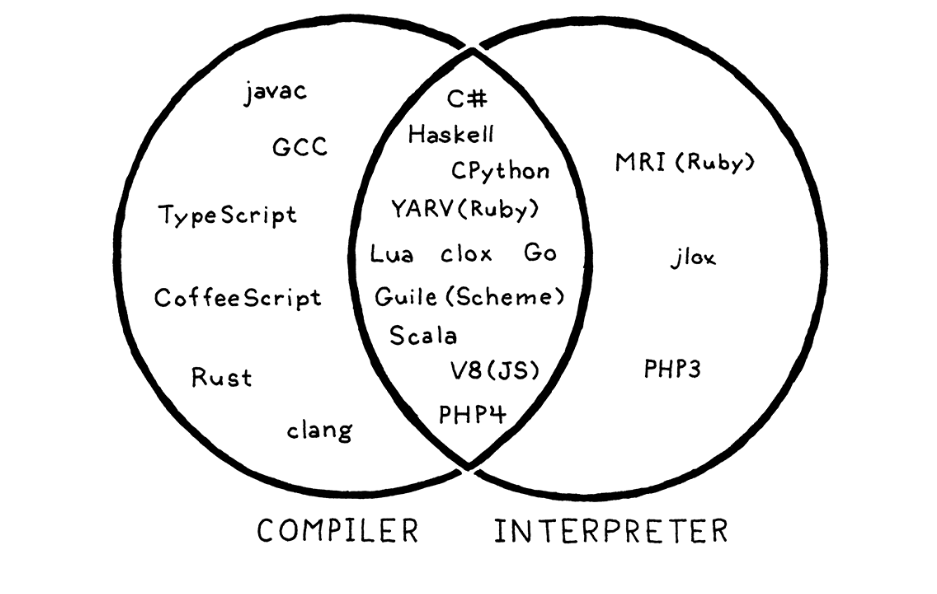

# Ch. 2 - A Map of the Territory

* Let's take a look at our roadmap

### 2.1 - The Parts of a Language

* Programming languages are designed roughly the same today as they were when they were first invented
* Let's visualize the overall path an interpreter takes to go from source code to machine code:

* We visualize the path as a mountain, where we start at the base on the bottom-right with the source code
* We parse and analyze the source code, until we arrive at the "peak", where we have a bird's-eye view of the user's program and know what the code *means*
* We then descend the other side of the mountain, and transform this high-level view into sucessive forms of lower-level code, slowly getting closer to something the CPU can actually execute
* Let's start with some actual source code:

* As you can see, the source code consists of a number of ASCII characters in sequential order
  
##### Scanning

* The first step is **scanning**, also called **lexing** or **lexical analysis**
* A **scanner** or **lexer** is code that takes in a linear stream of characters and chunks them together into a series of **tokens**, which are the "words" of the programming language
* Some characters are ignored by the scanner, depending on the language (e.g. most languages ignore whitespace, some even ignore new lines)

##### Parsing

* The next step is **parsing**, where our syntax gets a **grammar**
* This means that the flat sequence of tokens is converted into a tree structure that represents the logic and grammar of the language
* These are called **parse trees**, **syntax trees**, **ASTs**, or just **trees**
* An error at this step would be called a **syntax error**

##### Static Analysis

* The previous two steps are fairly similar across most languages
* Now, the individual characteristics of a language come into play
* Some of the analysis interpreters do:
  * **Binding** or **resolution**: For each identifier, find where that name is defined, and wire the two together
  * **Scope**: Find the accessability of each identifier
  * **Type**: If the language is statically typed, that's checked here. An error here would be a **type error**
* Often this information is stored as **attributes** on the syntax tree itself, or in a lookup table on the side (called a **symbol table**)
* The most powerful bookkeeping tool is to transform the tree into an entirely new data structure that more directly expresses the semantics of the code. That’s the next section!
  
##### Intermediate Representations

* The compiler can be thought of as a pipeline where each stage's job is to organize the data representing the code in a way that makes the job easier for the next part
* What's been done so far can be thought of as "Front-end", and the "Back-end" is what actually does the work to translate code into machine code
* What we have here is the "Middle-end", which makes the job of the back-end easier
* In this middle stage, code may be stored in some intermediate representation, which may often be something different than the source language and target platforms
* This has the advantage of making it easier to support multiple source languages and target platforms, since you can write one implementation for each source language, one implementation for each target platform, and mix and match them as you'd like

##### Optimization

* Once we understand what the program means, we can optimize it
* An example: say we have a variable defined as `pennyArea = 3.14159 * (.75 / 2) * (.75 / 2)`, which we are using to calculate penny masses for a number of penny densities. Instead of calculating it each time, we can replace this with `pennyArea = 0.441786` in the compilation process
* A lot of work goes into optimizing, squeezing every drop of performance from the compilation process

##### Code Generation

* We're now finally in the back end, descending the other side of the mountain
* After optimizing, we need to generate code. We have a few options for what low-level code to generate
* We could of course generate pure machine instructions in binary, but this is difficult because modern ISA's are highly complex, and you'd have to write a unique compiler for every possible architecture
* Another option is to output **p-code** (portable code) or **bytecode**, where each instruction is often a single byte long. These can be an intermediate between user code and machine language

##### Virtual Machine

* You can either write a mini-compiler to compile between p-code and each architecture, which is a lot of work but much easier due to p-code's simplicity and portability
* You could also write a virtual machine that emulates a hypothetical chip supporting your virtual architecture at runtime
* This is what we'll do for clox

##### Runtime

* We need to write some code to handle things during runtime
* For example, if the language automatically manages memory, we need a garbage collector
* Any run-time tests, such as "instance of" and the like need to happen at run-time

### 2.2 - Shortcuts and Alternate Routes

* Above we described the long path a compiler could take to implement every possible phase in the compilation process
* Many languages however skip some steps:
* Single-Pass Compilers:
  * Some languages generate code directly in the parser, skipping the later steps
  * This restricts the design of the language, since you don't revisit any previously parsed code, and you need to evaluate everything in one pass
  * This is how C works, and why you need to forward declare any functions you use that are defined later
* Tree-walk Interpreters:
  * Some languages start code generation right when the AST is generated in the parsing step, by traversing the tree and executing instructions
  * This is uncommon for general-purpose languages, usually slow
  * Jlox will function this way
* Transpilers:
  * What if instead of trying to go all the way from your language's code to p-code/machine code, you didn't go as far down the mountain and instead compiled to another source language, and let its compiler do the rest of the work?
  * This is called a **source-to-source** compiler, or more commonly a **transpiler**
  * A lot of languages target C, since it has compilers for pretty much every UNIX system
  * A lot target JavaScript as well, since JS is the only way to execute code on the browser (other than WebAssembly, which is quite new)
* Just-in-time Compilation:
  * This is dangerous, should only be done experts
  * Instead of compiling and then sending out the program, the program compiles quickly when it's run
  * This has the advantage of being able to be agnostic of the end-user's architecture, unlike most compilers which need a different binary executable for each architecture/OS
  
### 2.3 - Compilers and Interpreters

* What is actually the different between compilers and interpreters?
* **Compiling** is an *implementation technique* that involves translating a source language into some other, usually lower-level language
* When we say a language implementation "is a **compiler**", we mean it translates source code to another form but doesn't execute it, the user executes it themselves
* Conversely, when we say an implementation "is an **interpreter**", we mean it takes source code and executes it immediately, it runs from the source
* While some languages are clearly one or the other (C is only a compiler, python is only interpreter), many are a mix as well. For example CPython seems like an interpreter, but is definitely doing some compilation under the hood
* Here's a visual depiction:

* Jlox will firmly be an interpreter, while clox will be more in the middle

### 2.4 - Our Journey

* Don't worry, we're not expected to understand all of this immediately!
* This is just an overview, we'll get into details later
